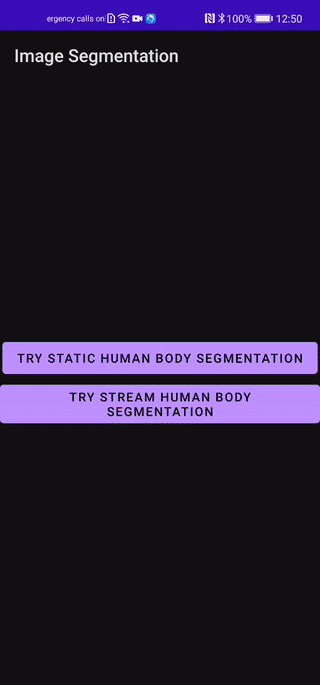

# Human Body Image Segmentation Test App

<table align="center">
  <tr>
    <td style="text-align:center"><b>Static Image Segmentation</b> </td>
    <td style="text-align:center"><b>Camera Stream Image Segmentation</b></td>
  </tr>
  <tr>
    <td style="text-align:center"></td>
    <td style="text-align:center"></td>
  </tr>
</table>

This test app contains two different use-case of **Human Body Image Segmentation**. 
- Static Image Segmentation
- Camera Stream Image Segmentation

Check the articles out for more.

🤖**Static Image Segmentation**: [Wait, where is my background went?](https://medium.com/huawei-developers/wait-where-is-my-background-went-8c41f99f2f2c)

🤖**Camera Stream Image Segmentation**: [Isn’t that nice background?](https://medium.com/@yektasarioglu/isnt-that-nice-background-3195d8b34ede)